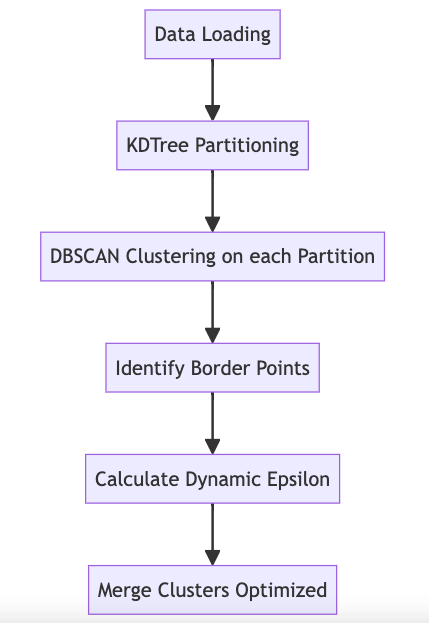

# 🌍 GeoLife Trajectory Clustering & Analysis

This project processes and clusters GPS trajectory data from the GeoLife dataset using Spark and Python, leveraging k-d tree partitioning and DBSCAN clustering to efficiently analyze geographic patterns, especially useful for irregularly shaped and variable-density datasets.

---

## ✨ Key Features

- 📂 **Data Sampling**: Parses and samples GPS data from GeoLife `.plt` files.
  
- 🌳 **k-d Tree Partitioning**: Recursively divides data along longitude/latitude with **balanced, median-based splits** — ideal for high-dimensional, unevenly distributed spatial data.
  
- 📦 **Local DBSCAN Clustering**: Clusters each spatial partition independently, discovering **dense regions**, **noise**, and **border points**.

- 🚧 **Border Point Detection**: Dynamically identifies points near partition boundaries using **adaptive epsilon**, flagging potential cross-cluster connections.

- 🔗 **Cluster Merging**:
  - Builds a **KDTree** to detect nearby border points across partitions.
  - Constructs a **graph with clusters as nodes** and edges between clusters with close border points.
  - Applies **connected component detection** for final merged clusters.

- 📊 **Visualization**: Generates intuitive plots and geospatial maps for clusters and borders — making patterns easily interpretable.



---

## ⚙️ Setup

### 🧰 Requirements

- **Python**: 3.7 or above  
- **Libraries**:
  - `pyspark`
  - `pandas`
  - `scikit-learn`
  - `matplotlib`
  - `geopandas`
  - `folium`
  - `networkx`
  - `scipy`

### 🛠️ Installation

1. Clone this repository and install dependencies:
   ```bash
   git clone https://github.com/yourusername/GeoLife-Trajectory-Clustering.git
   cd GeoLife-Trajectory-Clustering
   pip install -r requirements.txt
   ```
2. Download the [GeoLife dataset](https://www.microsoft.com/en-us/research/project/geolife-building-social-networks-using-human-location-history/) and place it in the `data/` folder.

3. Start a Spark session in your notebook or script:
   ```python
   from pyspark.sql import SparkSession
   spark = SparkSession.builder.appName("GeoLifeData").getOrCreate()
   ```

## 🛰️ Results

This project delivers a **robust, distributed framework** for clustering large-scale GPS trajectory data with high spatial complexity. It is optimized for datasets like GeoLife that feature:

- 🌐 **Spatial Irregularities**: Effectively manages non-uniform distributions and real-world trajectory noise.
- 🧭 **Local Density Variations**: Maintains cluster integrity by adapting to regions of varying point density.
- 🔗 **Cross-Partition Merging**: Seamlessly merges clusters that span across partition boundaries using graph-based techniques.

The final result?  
> Clean, interpretable cluster groupings that **scale beautifully** with data volume and **preserve geographic context**, making them ideal for mobility analysis, urban planning, and location-based services.

