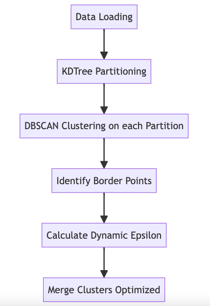

# GeoLife Trajectory Clustering and Analysis

This project processes and clusters GPS trajectory data from the GeoLife dataset using Spark and Python, leveraging k-d tree partitioning and DBSCAN clustering to efficiently analyze geographic patterns, especially useful for irregularly shaped and variable-density datasets.

## Key Features
- **Dynamic Density-Based Clustering**: Uses DBSCAN to identify clusters based on density, handling irregular shapes and densities effectively.
- **k-d Tree Partitioning**: Recursively splits data based on geographic dimensions (longitude/latitude) with balanced, median-based splits. This ensures optimal partitioning for high-dimensional data and varying densities.
- **Border Point Detection and Merging**: Detects border points near partition boundaries, assigns them dynamically based on proximity, and merges clusters across partitions.


## Key Features
- **Data Sampling**: Extracts and samples data from GeoLife `.plt` files.
- **k-d Tree Partitioning**: Divides geographic data using a k-d tree to optimize clustering.
- **DBSCAN Clustering**: Applies DBSCAN to partitioned data for density-based clustering.
- **Border Detection**: Detects border points in clusters for merging across partitions.
- **Visualization**: Generates visualizations of clusters and borders for spatial analysis.


## Methodology
1. **k-d Tree Partitioning**:
   - Data is split by alternating longitude and latitude, using median values for balanced splits.
   - Recursive, balanced partitioning supports data with high variability in density and structure.

2. **DBSCAN Clustering**:
   - Each partition is clustered separately, identifying dense regions and border points for merging.
   - Border points are dynamically identified by checking proximity to boundaries and applying a dynamic epsilon value.

3. **Cluster Merging**:
   - Uses a KDTree to find pairs of border points within epsilon distance.
   - Constructs a graph with clusters as nodes and edges between close clusters, identifying connected components for final merged clusters.

4. **Visualization**: Generates visualizations to illustrate the spatial distribution and relationships among clusters.



## Setup

### Requirements
- Python (>= 3.7)
- **Libraries**: `pyspark`, `pandas`, `scikit-learn`, `matplotlib`, `geopandas`, `folium`, `networkx`, `scipy`

### Installation
1. Clone this repository and install dependencies:
   ```bash
   git clone https://github.com/yourusername/GeoLife-Trajectory-Clustering.git
   cd GeoLife-Trajectory-Clustering
   pip install -r requirements.txt
   ```
2. Download the [GeoLife dataset](https://www.microsoft.com/en-us/research/project/geolife-building-social-networks-using-human-location-history/) and place it in the `data/` folder.

3. Start a Spark session in your notebook or script:
   ```python
   from pyspark.sql import SparkSession
   spark = SparkSession.builder.appName("GeoLifeData").getOrCreate()
   ```

## Results
The approach provides a scalable method for clustering large-scale, irregular geographic data, identifying and merging clusters across partitions with precision.
